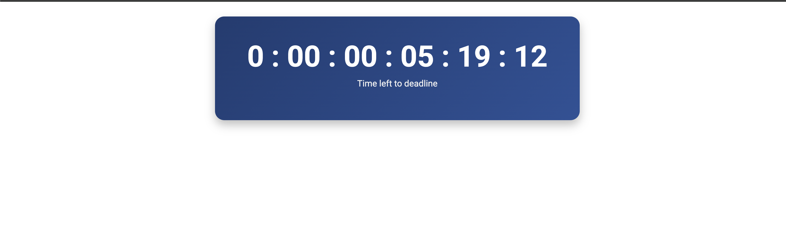

# TimerApp

This project was generated using [Angular CLI](https://github.com/angular/angular-cli) version 19.1.4.

## Development Server

To start a local development server, run:

```bash
npm start
```

Alternatively, you can use:

```bash
ng serve
```

**Note:** `ng serve` will only run the Angular frontend and not the backend API.

Once the server is running, open your browser and navigate to `http://localhost:4200/`. The application will automatically reload whenever you modify any source files.

## Timer Display Types

By default, the timer displays time in seconds.


### Switching to Year:Month:Day:Hour:Minutes:Seconds Format

To enable the extended time format, follow these steps:

1. **Uncomment** the following line in the timer component:
   - [Seconds Format Code](https://github.com/alihasan00/timer-app/blob/abef65e8191058e030072cd9619848cc079b6999/src/app/components/timer/timer/timer.component.ts#L25)

   

2. **Comment out** the following line to disable the default seconds-only display:
   - [Yearly Format Code](https://github.com/alihasan00/timer-app/blob/abef65e8191058e030072cd9619848cc079b6999/src/app/components/timer/timer/timer.component.ts#L28)

This will switch the timer to display time in `YYYY:MM:DD:HH:MM:SS` format.

---

For any issues or contributions, feel free to submit a pull request or open an issue in the repository.